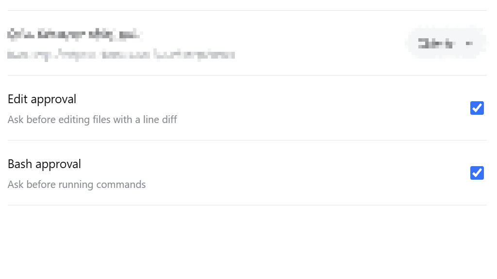
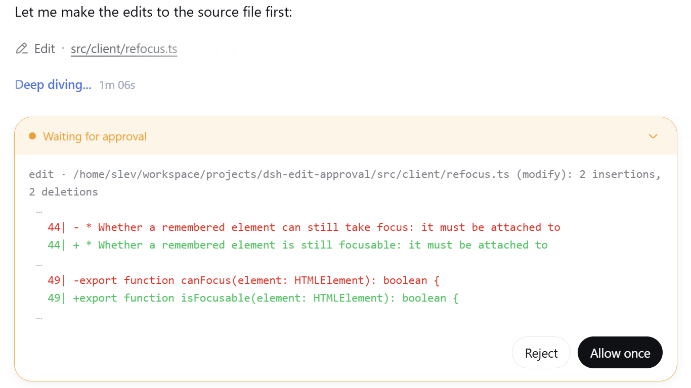
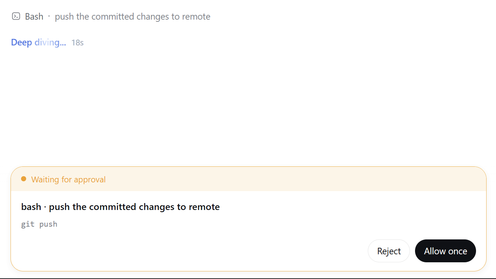
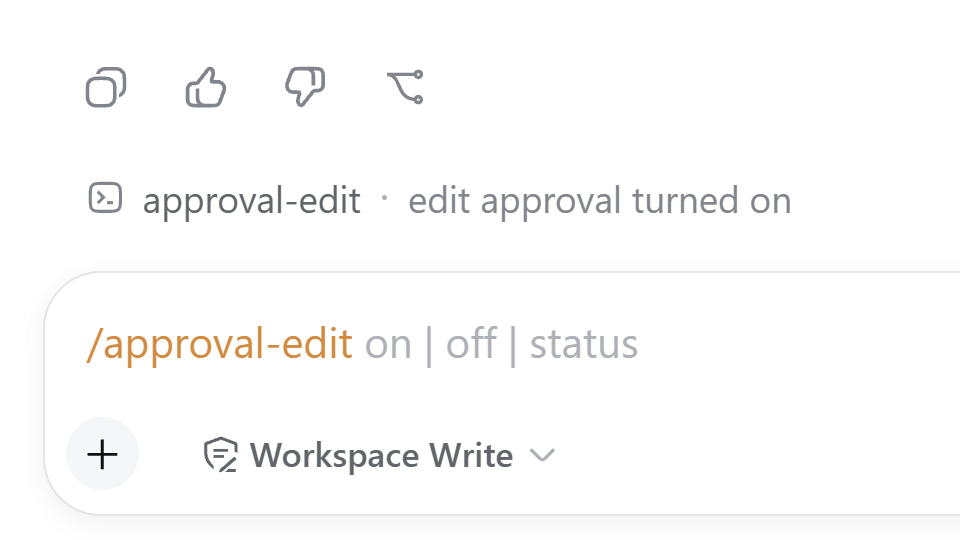

# dsh-edit-approval

为 [DeepSeek Harness](https://github.com/deepseek-ai/deepseek-harness) 提供**先询问后执行**的审批：**每次 `write` / `edit` / `str_replace_editor` 调用都在文件真正落盘前先询问——弹出红绿行级 diff，同意一次 / 拒绝——每次 `bash` 命令执行前也先询问**，两者在 Settings → General 各有独立总开关。

[](https://www.npmjs.com/package/dsh-edit-approval)
[](https://github.com/SiriLee/dsh-edit-approval/blob/main/LICENSE)

> [English](README.md) | 中文

刻意保持聚焦，只做一件事：**两扇镜像对称的审批门——编辑与命令**——让 agent 未经你同意就无法改动文件或执行命令。

| 审批门 | 拦截目标 | 默认 | 面板 |
| --- | --- | --- | --- |
| **编辑审批** | `write` / `edit` / `str_replace_editor` | 开 | 红绿行级 diff——同意一次 / 拒绝 |
| **命令审批** | `bash` | 关 | 描述 headline + 原生命令行 |

两扇门共用 harness 自带的 `serviceAsk` seam：插件在 `tools/pre-execute` 返回 `{ kind: 'ask', reason }`，harness 将其路由进 Web 审批面板——**host 端零 UI 改动**——`allowed-once` 继续执行、`rejected` 拒绝调用；在 `never` 策略下插件直接委托，全权会话照常工作。

## 效果预览

安装后 Settings → General 出现两行开关——**编辑审批 / 命令审批**。所有写类调用先弹出红绿 diff 面板；开启命令审批后，每条命令先弹出面板：白色 headline 是 agent 的描述，灰色行是命令原文。

<table>
  <tr>
    <td align="center"><br><sub>Settings → General 总开关</sub></td>
    <td align="center"><br><sub>编辑审批面板——红绿行级 diff</sub></td>
  </tr>
  <tr>
    <td align="center"><br><sub>命令审批面板——描述 + 命令</sub></td>
    <td align="center"><br><sub>/approval-edit 与 /approval-bash 命令</sub></td>
  </tr>
</table>

## 安装

```sh
dsh plugin --profile web add dsh-edit-approval
```

装完重启 `dsh web`（`--profile web`）生效。

给贡献者：可从本地 checkout、pin 的 commit 或离线 tarball 安装——`dsh plugin --profile web add /path/to/dsh-edit-approval`、`dsh plugin --profile web add github:SiriLee/dsh-edit-approval#<sha>` 或 `npm pack` 后 `dsh plugin --profile web add ./dsh-edit-approval-<version>.tgz`。git 安装首次会失败：pnpm 默认禁止 git 依赖执行构建脚本，需先在 profile 的 `pnpm-workspace.yaml` 加 `allowBuilds`；之后 pnpm 会执行插件的 `prepare` 并装入 profile。`npm pack` 同样运行 `prepare`，tarball 内始终包含预构建 `lib/`（含 `.d.ts`）与 `LICENSE`。

## 使用

1. **编辑审批默认开启。** 任何 `write` / `edit` / `str_replace_editor` 调用都在文件被触碰前先询问。面板只显示改动行——删除红色、新增绿色——带右对齐 `NN|` 行号 gutter，被跳过的上下文与 hunk 间隔以 `…` 省略号标记。
2. **同意一次 / 拒绝。** `allowed-once` 放行该调用；`rejected` 拒绝并反馈给模型。
3. **命令审批默认关闭**——在 Settings → General 或通过下面的命令开启。面板白色 headline 是描述（如 `bash · push to remote`）；下方灰色行是命令原文，由 harness 原生渲染。
4. **命令行入口：** `/approval-edit on|off|status` 与 `/approval-bash on|off|status`——与设置行同源。
5. **白名单（仅配置文件）：** `bash-approval` 设置命名空间下，`allow` 存放始终放行的命令前缀。匹配做了空白归一化（`git  push` 命中 `git push`），无法用多余空格绕过。暂不提供 UI。

## 原理

插件监听 `tools/pre-execute` 瀑布（harness 在工具执行前的 seam），按工具名分派到两扇门之一——名称重叠时编辑门优先。

### 1. 编辑审批

对每个被拦截的写类调用：

1. **解析目标文件**：经 `ctx.fs` 解析路径，沿用 fs 工具的会话 cwd 规则（相对路径含 `..` 时对 cwd 做规范化）。
2. **读取当前内容**并按工具参数重建**拟写入内容**，镜像各工具语义：`write` — 全文；`edit` — 唯一替换（或 `replace_all`）；`str_replace_editor` — `str_replace` 唯一替换、`insert` 按行插入、`create` 用 `file_text`。
3. **计算行级 diff**：用 jsdiff 的 `structuredPatch`（Myers）——与 harness 的 write/edit 结果卡同一参考实现、同一 3 行上下文窗口——因此**审批预览与执行后的结果卡同源同形**，大文件里改 1 行仍是 1 行 diff。
4. **返回 `{ kind: 'ask', reason }`**：头部一行（`工具名 · 文件 (操作): N insertions, M deletions`）加 diff 文本。harness 的 `serviceAsk` 经 `ctx.approval` 路由进 Web 审批面板。

### 2. 命令审批

纯决策，**不碰 fs**——不读不写任何东西：

- 门关闭、工具不在 `tools` 列表、命令为空，或属于**沙箱升级调用**（带 `sandbox_permissions` + `justification`——它们自带审批，不能二次弹窗）时直接放行。
- **白名单优先**：空白归一化后的前缀命中即免询问放行。
- 否则返回 `{ kind: 'ask', reason }`，headline 单行——`bash · <描述>`（描述为空时退化为 `bash`）。命令文本**不**嵌入 reason：harness 会在面板命令行原生渲染，避免内容重复。

### 3. 共享策略处理

会话审批策略（`ask` / `never`）持续生效。在 `never`（如 `danger-full-access`）下，插件发出的每个 `ask` 都会被审批服务确定性转为拒绝，导致全权会话里所有编辑与命令被静默打断——因此两扇门都通过 `next()` 委托、交由沙箱约束。插件绝不扩大权限，也不改变沙箱模式。

### 4. 审批面板

浏览器端（`dsh.client`）按动画帧合并的 `MutationObserver` 发现并增强面板，所有副作用收敛在单个 `ctx.effect`（卸载 / HMR 时完整清理）：

- **编辑面板**：把纯文本 headline 重建为**仅改动行**——删除红色、新增绿色、右对齐 `NN|` 行号——并注入 `white-space: pre-wrap` 补偿样式、为多行 diff 安装折叠按钮。
- **命令面板**：保持 harness 原生——只打 `dsh-ea-kind-command` 标记，不重写、不重排——白色描述 headline 与灰色命令行就是 harness 原样渲染的结果。

## 配置

运行时配置位于两个设置命名空间——`edit-approval` 与 `bash-approval`——层级为**schema 默认值 < cordis 行 config < 用户设置页（持久化）**。cordis 行默认不带 config；profile patch 只需重写要改的键即可覆盖部署默认值：

```yaml
# profile 的 cordis.patch.yml
- id: dsh-edit-approval
  name: dsh-edit-approval
  config:
    minDiffLines: 2
    includeCreate: false
```

| 命名空间 | 键 | 默认 | 说明 |
| --- | --- | --- | --- |
| `edit-approval` | `enabled` | `true` | 编辑审批总开关 |
| `edit-approval` | `tools` | `['write','edit','str_replace_editor']` | 拦截白名单（注册工具名） |
| `edit-approval` | `minDiffLines` | `0` | 变更行数**至少**达到此值才询问；更小的改动静默放行 |
| `edit-approval` | `includeCreate` | `true` | 新建文件是否询问 |
| `edit-approval` | `includeDelete` | `true` | 清空/删除文件是否询问 |
| `bash-approval` | `enabled` | `false` | 命令审批总开关 |
| `bash-approval` | `tools` | `['bash']` | 拦截白名单（注册工具名） |
| `bash-approval` | `allow` | `[]` | 始终放行的命令前缀（空白归一化匹配） |

配置面按契约**前向兼容**：新键只增不改不删、且必须带默认值——旧版本插件静默忽略未知键，因此新配置文件在旧版本上依然安全。

## 明确不做的事

- **不越权、不扩大沙箱**——从不改变沙箱模式或授予权限；升级调用放行给沙箱自己的审批。
- **不拦截命令内部的编辑**——`bash` 命令内执行的文件修改不受编辑门管辖（开启命令审批后由命令门覆盖）。
- **不支持部分应用**——diff 是只读预览（`+` / `-` 行标记），不能只应用其中几行。
- **工具自身会失败的情形不询问**——如 `str_replace_editor create` 命中已存在文件、`old_str` / `old_string` 非唯一或缺失，放行由工具报错。空 `old_string` 的 `edit` 预览与工具行为有偏差（视为 not-found 放行）——偏差方向安全，不会误拦截。
- **键盘快捷键**（Enter 审批 / Esc 拒绝）——已拆分到独立插件 [dsh-approval-hotkeys](https://github.com/SiriLee/dsh-approval-hotkeys)。
- **编辑后审查 / 回滚**——由社区 [dsh-change-review](https://github.com/cirelir/dsh-change-review) 覆盖。
- **权限档位扩展**——由社区 [dsh-auto-approval-plugin](https://github.com/StyxNether/dsh-auto-approval-plugin) 覆盖。

## 兼容性

- Node.js `^22.19.0 || >=24.0.0`。
- DeepSeek Harness web 配置档（`dsh --profile web`）；`@deepseek-ai/*` peer 包由 harness 运行时提供。
- 注册工具名是 `str_replace_editor`（下划线），与 npm 包名 `@deepseek-ai/dsh-tool-str-replace-editor` 不同。

> [!WARNING]
> 本项目与 DSH 均处于 developer preview。可复现环境请固定精确版本，并留意上文的行为说明。

## 安全

插件仅在 `tools/pre-execute` 拦截点读取目标文件以计算编辑预览；命令门完全不碰文件。它从不自行写入文件——只有在你批准后，工具本体才执行写入。无网络请求，不访问任何凭据。

## 开发

```sh
npm install            # devDeps 来自 npm registry
npm run typecheck      # tsc 双编译面（host + client）
npm test               # vitest：diff / guard / command-guard / display-parity / 集成 / client 套件
npm run build          # 全量构建：tsc → lib/（含 .d.ts）+ lib/client.js bundle
npm run build:portable # 可选：轻量 esbuild 构建，不做类型检查
node scripts/verify-host.mjs   # 对 BUILT host 产物做端到端验证（两个命名空间 + 全部命令路径）
```

`prepare` 生命周期运行全量构建，因此 git 安装与 `npm pack` / `npm publish` 始终得到完整的 `lib/`（含 `.d.ts`）与 `LICENSE`。

## 发布

发版走 GitHub Actions Trusted Publishing（OIDC，无需存储 `NPM_TOKEN`）。详见 [docs/npm-trusted-publishing-guide.md](docs/npm-trusted-publishing-guide.md)。

```sh
npm version patch && git push origin main --tags   # 触发 .github/workflows/publish.yml
```

workflow 会校验 tag 与 `package.json` 版本一致，执行 typecheck + 测试 + 全量构建 + 产物验证，以 Sigstore provenance 发布并创建 GitHub Release。CI（`.github/workflows/ci.yml`）在每次 push / PR 上运行同样的检查。发布步骤幂等——版本已在 npm 则跳过。

## 许可

[MIT](LICENSE)
